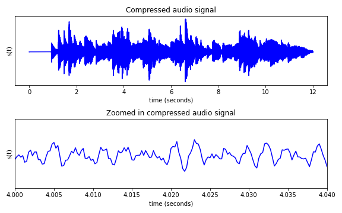
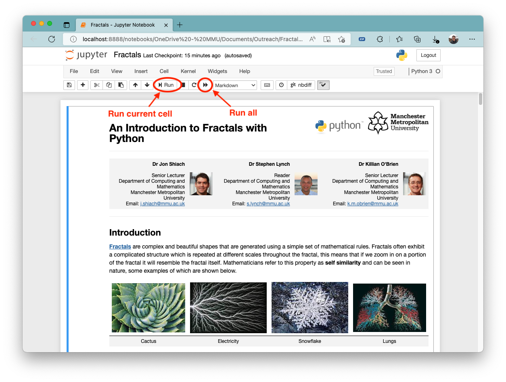
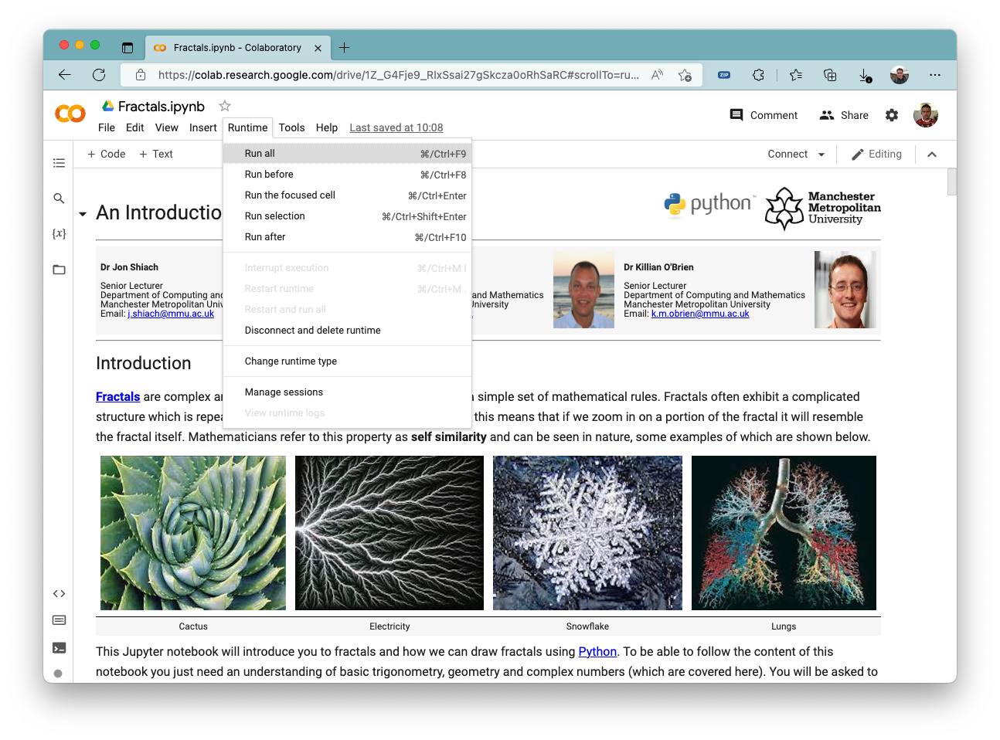
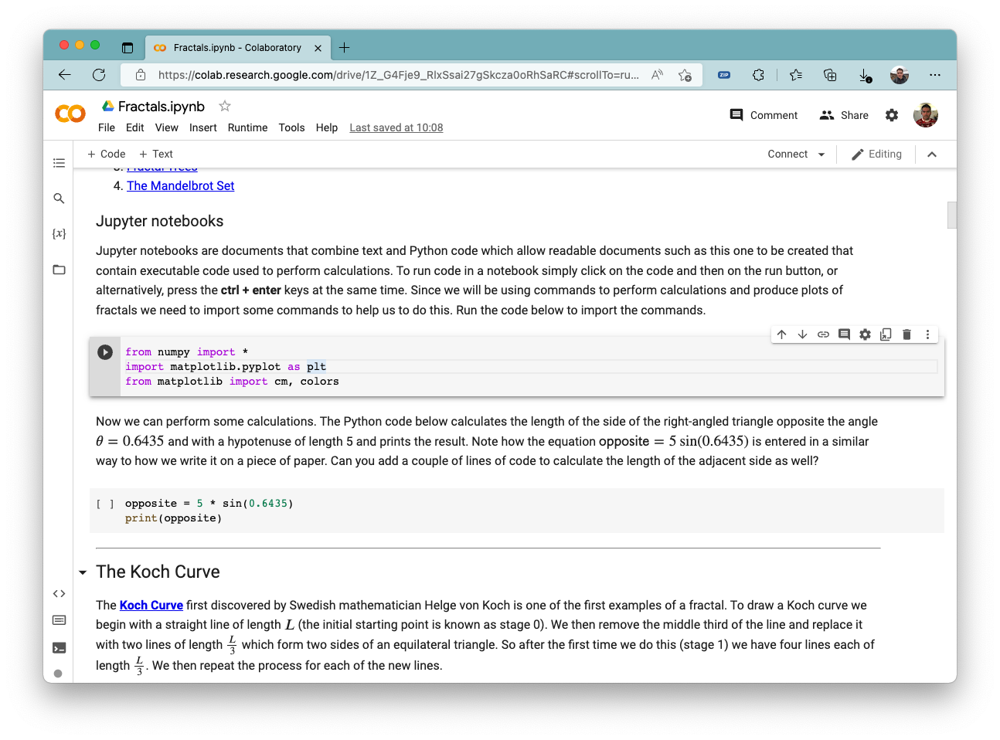

A run outreach events for open days and school visits designed to give participants a flavour of undergraduate mathematics whilst still being accessible to someone with a school level knowledge of the subject. These sessions make use of the programming language Python to produce plots, animations and sounds that demonstrate how mathematics is used in everyday life as well as research. The sessions can be tailored to individual needs.

If you are interested in arranging an outlook session please contact our faculty outreach officer Laura Currid ([l.currid@mmu.ac.uk](mailto:l.currid@mmu.ac.uk)) for more information.

## Fractals with Python

  

[Preview](../files/outreach/fractals_notebook.html)

Fractals are complex and beautiful shapes that are generated using a simple set of mathematical rules. This session will introduce participants to some common fractals, show how they are drawn and how we can write Python programs to do this.

## Chaos

  

[Preview](../files/outreach/chaos_notebook.html)

You may have heard of the Butterfly effect which comes from the question *“Does the flap of a butterfly’s wings in Brazil set off a tornado in Texas?”*, in other words, can a very small change in a system result in large changes elsewhere? This is what mathematicians refer to as chaos and in this session participants will be introduced to some examples of chaotic behaviour in relatively simple systems such as the motion of a double pendulum and the orbits of bodies acting under gravity.  

## Mathematics of music

  

[Preview](../files/outreach/music_notebook.html)

The creation of electronic music and the streaming of music over the internet used by apps such as Spotify, YouTube and TikTok would not be possible without mathematics. In this session you will be introduced to sine waves and how they can be combined to produce audio signals that replicate musical notes. In addition, you will see how a mathematical theory published 200 years ago is used to encode audio signals so they can be compressed and streamed over the internet.

## Mathematical modelling of a zombie outbreak

[Preview](../files/outreach/zombie_notebook.html)

This session will introduce participants to a mathematical modelling technique called *agent-based modelling* where individual autonomous agents which could be a single animal or person are given rules to govern their behaviour. For example, in a social distancing situation each agent will want to avoid getting too close to another agent. We can use agent-based modelling to build mathematical models that simulate the motion of a flock of birds and the transmission of infectious diseases such as Covid or a zombie outbreak (unlikely to happen but you never know). 

## Jupyter notebooks

The outreach materials are written using [Jupyter notebook](https://jupyter.org/) which makes it easy to write and execute Python code. The individual notebooks for the various sessions can be downloaded by clicking on the links below.

- [Fractals](../files/outreach/Fractals.ipynb)
- [Chaos](../files/outreach/Chaos.zip)
- [Mathematics of music](../files/outreach/Music.zip)
- [Mathematical modelling of a zombie outbreak](../files/outreach/Zombie.ipynb)

To run the notebooks you will first need to make sure you have Jupyter installed on your computer. The easiest way to do this is to download and install [Anaconda](https://www.anaconda.com/) which is a software suite which includes Jupyter.

1. Go to [www.anaconda.com](https://www.anaconda.com/) and click on the download link. This should download the appropriate installer for your operating system.
2. Install Anaconda onto your computer. In most instances the default installation options will suffice. Note that you may need administration privileges to install Anaconda.
3. Run Jupyter
    - Windows: click on the start menu button and type **Jupyter**
    - macOS/Linux: run **Anaconda Navigator** and select **Juypter notebook**
4. Using the file browser which should have opened in your web browser, navigate to the notebook you downloaded and click on it. This should open the Jupyter notebook.
5. Click on the run all button to run the notebook. This will execute any code that has been entered in to the code cells. To run an individual cell click on it and click on the run button.

### Google Colab

If you are unable to install Jupyter on your computer you can run Jupyter notebooks in the cloud using [Google Colab](https://colab.research.google.com/). To do this you will need to have a [Google account](https://www.google.com/account/about/).

1. If you already have a Google account skip this step. Go to [https://www.google.com/account/about/](https://www.google.com/account/about/) and sign up for a Google account.
2. Go to [https://colab.research.google.com/](https://colab.research.google.com/) and log into your Google account.
3. Click on **Upload** and upload the notebook you have downloaded.
4. Click on **Runtime** and **Run all** to run the notebook

6. To run an individual code cell click on it and then click on the play button to the left of the cell. 
