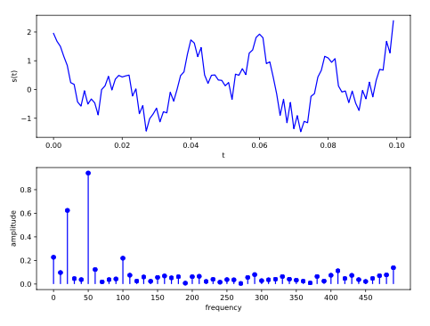



I teach across a number of units and courses at the Manchester Metropolitan University. I currently teach units on linear algebra, programming, computational mathematics, numerical methods for ODEs and graduate development and employability. My teaching materials can be accessed below.

## Linear Algebra and Programming Skills

<!-- 

  
  

 -->

A first year unit that introduces students to linear algebra, [Python](https://www.python.org/) and [MATLAB](https://uk.mathworks.com/products/matlab.html) programming.

### Linear algebra

<a href="https://jonshiach.github.io/LA-book/" target="_blank">Linear algebra lecture notes</a>

Topics include: matrices, vectors, solving linear systems of equations, co-ordinate geometry, vector spaces and linear transformations.

### Programming skills

<!-- 

  
  

 -->

<a href="https://github.com/jonshiach/Programming_skills/archive/refs/heads/main.zip" target="_blank">Download programming skills materials</a>

The programming skills materials take the form of [Jupyter notebooks](https://jupyter.org/) for Python and [MATLAB live scripts](https://uk.mathworks.com/help/matlab/live-scripts-and-functions.html) for MATLAB. This allows students to enter and execute code in the same document as the instructional material.

## Computational Methods in Ordinary Differential Equations

<!-- 

  
  

 -->

<a href="https://jonshiach.github.io/ODEs-book/" target="_blank">Runge-Kutta Methods and Computational Linear Algebra Lecture notes</a>

A third year content that covers numerical methods for solving Ordinary Differential Equations (ODEs) and linear systems of equations. Topics include: initial value problems, the Taylor series, the Euler method, explicit and implicit Runge-Kutta methods, boundary values problems, LU, Cholesky and QR decomposition and Jacobi, Gauss-Seidel and SOR indirect methods. 

## Computational Mathematics

<!-- 

  
  
  

 -->

A second year unit that examines the implementation of mathematics in modern computing applications such as computer graphics used in computer games, digital sound processing and the fundamentals of computing mathematics. 

### Computer graphics

[Computer Graphics Lecture notes](/files/notes/graphics_notes.pdf){:target="_blank"}

Topics include: vectors, co-ordinate geometry, rotation, scaling and translation transformations, object space, world space, camera space and screen space transformations, clipping and hidden surface remove. 

[Computer Graphics: Display Techniques (old computer graphics unit)](/files/notes/display_techniques.pdf){:target="_blank"}

### Digital sound processing

[Digital Sound Processing Lecture Notes](/files/notes/sound_processing_notes.pdf){:target="_blank"}

Topics include: quantisation, signals, Fourier series, frequency spectra, the Discrete Fourier Transform (DFT), windowing, the Fast Fourier Transform (FFT) and creating digital music.

### Computing mathematics

[Computing Mathematics Lecture Notes](/files/notes/computing_maths_notes.pdf){:target="_blank"}

Topics include: binary and hexadecimal number systems, logic gates and logic circuits, Boolean algebra, Karnaugh maps, half and full adders, algorithms, complexity and recursion.

## Numerical methods for Partial Differential Equations

<!-- 

  

 -->

[Finite-Difference Methods Lecture Notes](/files/notes/finite_difference_methods_notes.pdf){:target="_blank"}

A third year unit that covers the numerical solution of Partial Differential Equations (PDEs). Topics include: the Taylor series, big-O notational, finite-difference approximations, boundary conditions, elliptic PDEs, the Laplace equation, hyperbolic PDEs, the advection equation, time marching schemes, parabolic PDEs, the heat diffusion equation and grid refinement studies.

## Advanced Ordinary Differential Equations and Dynamical Systems

[Runge-Kutta Methods Lecture Notes](/files/notes/Adv_ODEs.pdf){:target="_blank"}

A fourth year (MMath) unit that goes into more depth on numerical methods for solving ODEs. Topics include the derivation of Runge-Kutta methods using trees, adaptive step size control, implicit Runge-Kutta method, Newton's method for systems of nonlinear equation, stability, order stars and the n-body problem.